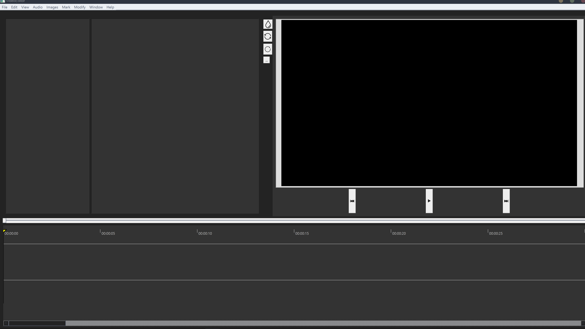
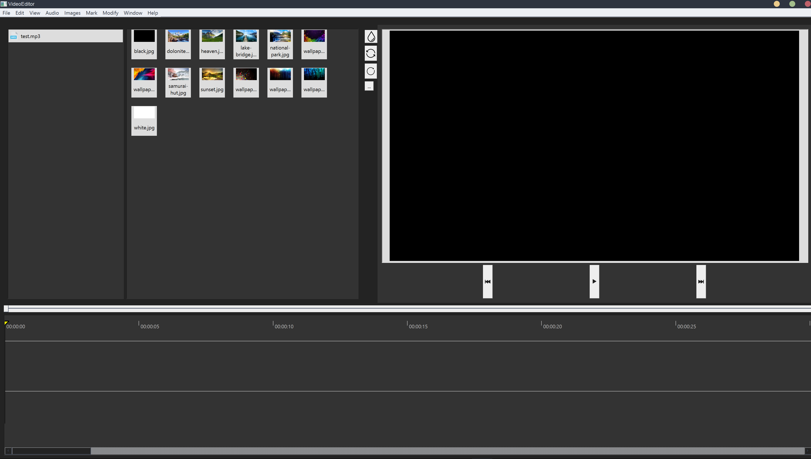
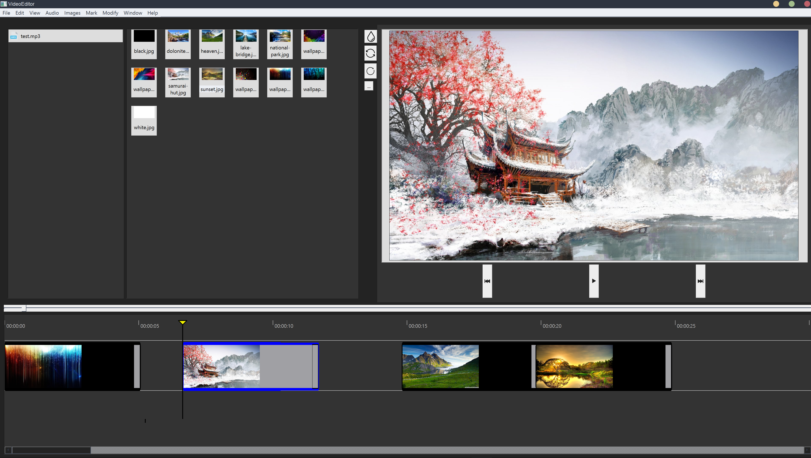
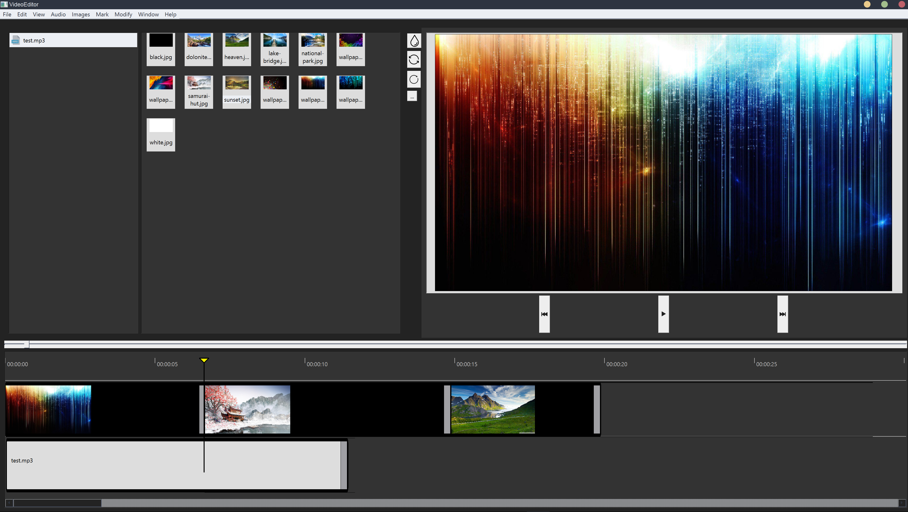
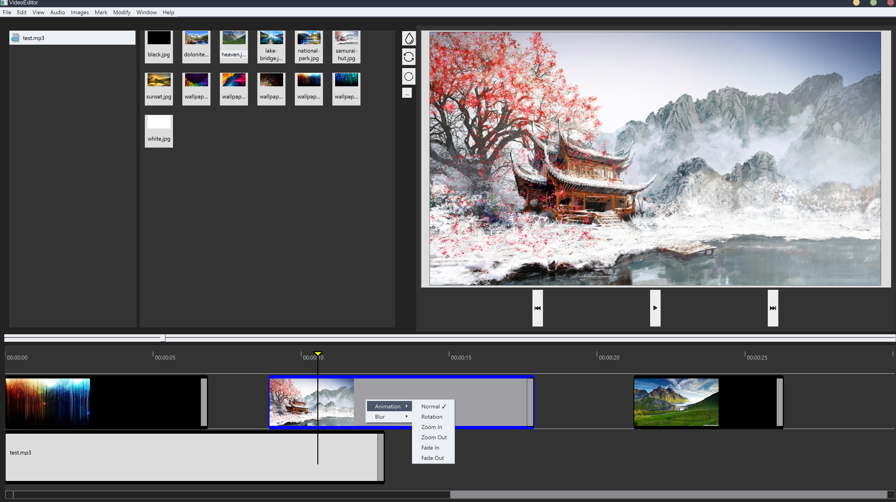
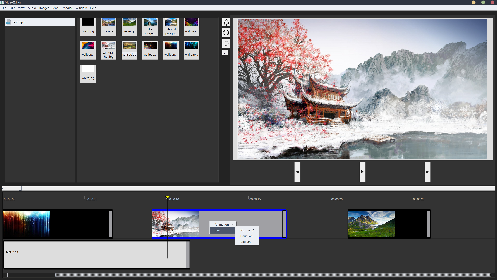
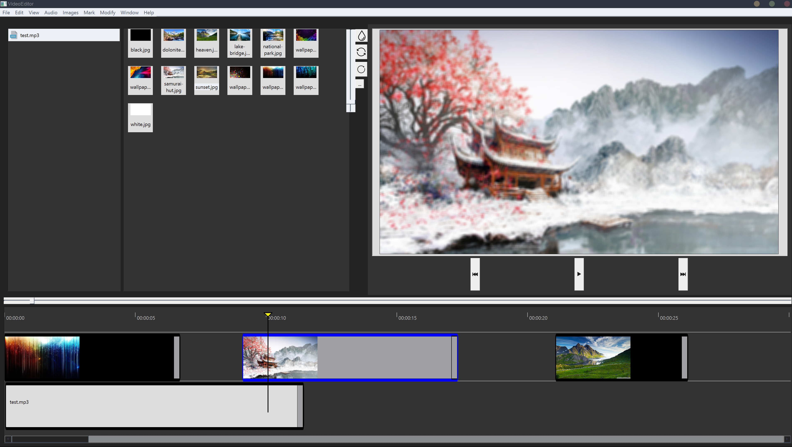
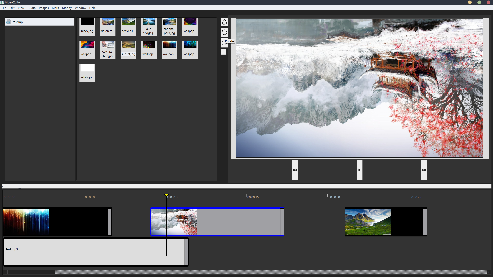
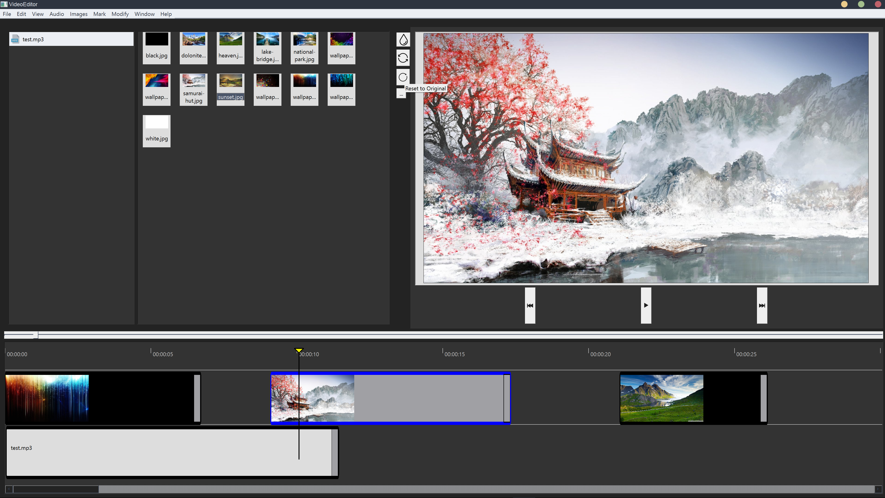
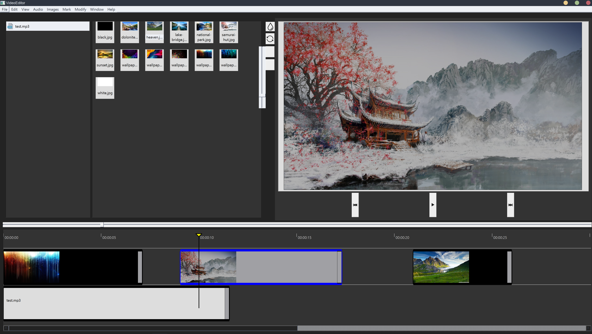

# V-CREST - Video Creation Software

This is a unique video creating software developed to help a user build a video out of a set of images.

## Members

| Name Surname                      |       Role       | Github username       | Trello username   |
|:---------------------------------:|:----------------:|:---------------------:|:-----------------:|
| Vrushank Agrawal                  |  project leader  | vrushank-agrawal      | vrushank_agrawal  |
| Duy Nhat Vo                       |    git leader    | nhat-vo               | lavawolf          |
| Lucia Carai                       | trello assistant | LuciaCarai            | luciacarai        |
| Dimitri Korkotashvilli            |  video manager   | Dimitri-Korkotashvili | dkorkot           |
| Lasha Koroshinadze                |  audio manager   | lashahub              | lashakoroshinadze |
| Hieu Le                           |                  | Hieu-Lee              | hieule203         |
| Minh Tung Nguyen                  |                  | minhtung0404          | minhtung0404      |
| Minjoo Kim                        |                  | minjoo-johanna        | minjookim44       |
| Hayate Sasaki                     |                  | hayate0s              | hayatesasaki      |
| Yufei Liu                         |                  | elisabeth04           | user24392150      |
| Yi Yao Tan                        |                  | yao-creative          | yiyaotan          |

## Teams
### GUI
* Duy Nhat Vo
* Hieu Le
* Minh Tung Nguyen
* Minjoo Kim

### Video processing and animations
* Dimitri Korkotashvilli
* Yufei Liu
* Lucia Carai

### Image processing and filters
* Vrushank Agrawal
* Yi Yao Tan

### Audio analyzing
* Lasha Koroshinadze
* Hayate Sasaki

## Third Parties Used
- QT v6.2.2
    - QT Multimedia (should be added while installing QT)
- FFmpeg v4.2.5
- OpenCV v4.5.4
- MinGW version v9.0.0 (should be added with QT)
- Clion v2021.3.2 (optional but recommended)

## Setup for CLion
- In `Setting(Preferences)/Build, Execute and Deployment`
    - Go to `Toolchains` and select your compiler (specify the same compiler with which OpenCV binaries will be built in later steps)
    - In CMake set: `-DCMAKE_PREFIX_PATH=path/to/your/Qt` (example [Mac] `~/Qt/6.2.2/MacOS`; [Windows] `C:\Qt\6.2.2\mingw_64\bin`)
    
## Setup for FFmpeg

### Windows
1. Download the latest version of FFmpeg from this [link](https://www.ffmpeg.org/download.html)
2. Unpack the files in a directory with the folder name `ffmpeg` (folder name is important)
3. Add the path to ffmpeg in environment variables (example [Windows] `C:\ffmpeg`)
4. If Clion is already open, then restart the IDE so that the environment variables can be updated.

### macOS
You can use homebrew to install. Run `brew install ffmpeq`.

## Setup for OpenCV
### Windows
- If qt is not added to path then add this path to environment variables `C:\Qt\Tools\QtCreator\bin`.
- If mingw is not added to path then add this path to environment variables `C:\Qt\6.2.2\mingw_64\bin`.
  (All paths are written assuming QT and OpenCV are downloaded in the directory `C:\`)
1. Download the latest version of OpenCV from this [link](https://opencv.org/releases/).
2. Unpack the files in `C:\opencv` or a folder of your choice (path will then be different in the next steps)
3. Create a new folder `release` or any other name in the opencv folder.
4. Open CMake GUI (download from this [link](https://cmake.org/download/)).
    - In "Where is the source code" put `C:\opencv\sources`.
    - In "Where to build the binaries" put `C:\opencv\release` and click `configure`.
    - Choose `Specify native compilers` and set the generator to `MinGW Makefiles`. Click `Next`.
    - For C compiler browse to the Qt directory and choose the gcc file (example `C:\Qt\Tools\mingw900_64\bin\gcc.exe` ).
    - For C++ choose the g++ file in the same folder ( example `C:\Qt\Tools\mingw900_64\bin\gpp.exe` ).
    - After configuration is complete search for `WITH_QT` in the search bar and tick/check its value.
    - Search for `CMAKE_BUILD_TYPE` and set its value to `Release`.
    - Click on `configure` and after configuration click on `generate`.
5. Now go to `C:\opencv\release\bin` and add this path to the environment variables.
6. Open Command prompt in `C:\opencv\release` and run `mingw32-make`. Wait for the installation to complete (takes a lot of time).
6. Now run the command `mingw32-make install` that creates an `install` folder in  `C:\opencv\release`.
7. Now add this path `C:\opencv\release\install\x64\mingw\bin` to environment variables.

### MacOS
1. Getting OpenCV Source Code
    - Download OpenCV source code using this [link](https://github.com/opencv/opencv/archive/4.5.4.zip) and unpack it.
2. Building OpenCV from Source Using CMake
    - Create a temporary directory, which we denote as `build_opencv` inside `opencv-4.5.4` folder, where you want to put the generated Makefiles, project files as well the object files and output binaries and enter there.
    - Generate Makefile (2 ways)
        - Using terminal: Open terminal on folder `build_opencv` and run `cmake -DCMAKE_BUILD_TYPE=Release -DBUILD_EXAMPLES=ON ../` on terminal
        - Using cmake-gui
            - set the opencv source path to the folder `opencv`
            - set the build path to the folder `build_opencv`
            - set `CMAKE_BUILD_TYPE` to `Release`
            - set `BUILD_EXAMPLES` to `ON`
            - run `Configure`
            - run `Generate`
    - Build by run `make -j7` on terminal
3. Add opencv to path
    - Open terminal
    - Run `sudo nano /etc/paths/`
    - Add the folder `opencv-4.5.4/build_opencv/bin` to the end of the files
    - `Ctrl + X` and save the files
    - Check it with terminal by `echo $PATH`. You should see the folder you just put.
    - Notes: it might be different for people who use zsh (you might need to edit it in `~/.zshrc`)

### Notes on OpenCV:
- Try to run `test_opencv` as a separate debug environment in CLion. In the `test.cpp` file, change the run command for `image_path` according to the OS (different for windows and mac). 
- If there is no error and the image `lena.jpg` is displayed then `CONGRATULATIONS!` OpenCV is successfully integrated. Otherwise, retry the entire process or look for possible errors on Google.
- For macOS, it is advised to use Xcode g++ compiler because other compilers run into to an error like `Undefined symbols for architecture arm64`. If you have this problem you probably want to change to Xcode g++ compiler.

## Guide To Use V-CREST v1.0

1. Run the project in build environment on your preferred IDE (CLion hopefully).

2. The main software window will appear.    
   

3. Start by importing some media (Ctrl + O) or choose import media option from File menu.

4. The imported media is now displayed in their respective panels.    
   

5. You can add images and audios to the respective timelines by double-clicking on the objects.

6. The selected object will be inserted after the slider if no object is available otherwise after the last object in the current state of the timeline.   
   

7. You can remove the objects from the timeline by double-clicking on them in the timeline.

8. The objects are automatically inserted for a duration of 5 seconds which can be extended or decreased manually using the slider at the end of each object.   
   

9. The objects can be shifted to various positions in the timeline by simply clicking and dragging.    
   

10. You can preview the created video by clicking the play button in the video preview panel.

11. To add a specific animation to an image, simply right-click on the image object and select the animation among:
    - Normal - Current state
    - Rotation - The image object will constantly rotate anticlockwise
    - Zoom In - The image will be zoomed in until the end of the object
    - Zoom Out - The image will be zoomed out until the end of the object
    - Fade In - The image will fade in from the beginning
    - Fade Out - The image will fade out until the end   
    

12. You may also add blur filters to smoothen images among:
    - Blur - normal blur function
    - Gaussian Blur - dynamically smoothens the edges in the image 
    - Median Blur - removes noise while preserving the edges (gives a paint-like feel)    
    

13. The intensity of the blur function can be increased or decreased from the blur slider (teardrop symbol) next to the video preview panel.    
    

14. An image may be rotated as well using the rotation button next to the video preview panel.   
    

15. An image can be reset to its original version as well using the reset button next to the video preview panel.    
    

16. Want to change the brightness of the image? You can do so using the third button in the video preview panel.    
    

17. With all these amazing editing options, your personalized video is now ready to be exported!

### Note on V-CREST v2.0
- The current editing features in the software are limited due to difficulties faced in building the GUI
- The next version will also boast a unique feature to automatically arrange images according to beats of a song
- The use will be provided with much more flexibility in terms of filters and animations that may be applied to an image
- The GUI will have more ease of use with better graphics
- And MUCH MORE!
